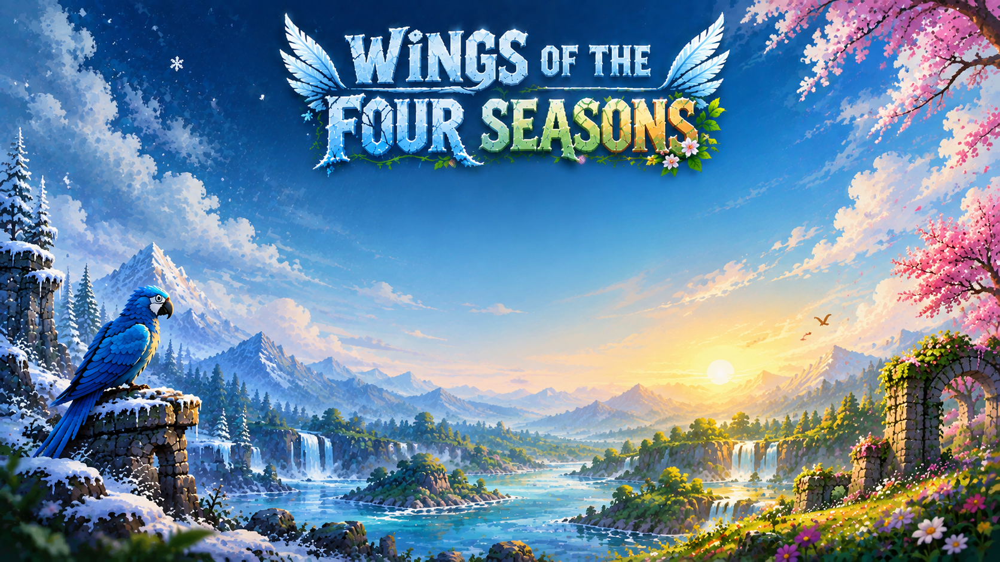

# Wings of the Four Seasons

## Game Description

**Wings of the Four Seasons** is a 2D side-scrolling flight adventure in which the player guides Aero, a blue macaw, on a journey to restore balance to a world where the seasons have fallen into disarray. Across four distinct biomes — Winter, Monsoon, Summer, and Spring — the player collects Seeds of Hope and other restorative pickups while dodging hazards unique to each season, from falling icicles and lightning strikes to hunters, storms, and desert heat. As each season is restored, Aero presses onward toward the final goal: bringing all four seasons back into harmony.

## Features
- Four fully realized seasonal levels (Winter, Monsoon, Summer, Spring), each with unique hazards, pickups, and visual themes
- Nature Restoration Meter and Energy system driving core progression and survival
- Feather-based lives system with visual HUD feedback
- Animated obstacles and enemies: icicles, storm birds, flying branches, hunters with aim/shoot AI, hawks, falcons, and tumbleweeds
- Powerup pickups (Seeds of Hope, Spring Blossoms, Dewdrops, Aegis Shields, Water Droplets, Desert Roses) with distinct effects on nature, energy, and life
- Cinematic story intro and inter-level transition slides narrating Aero's journey
- Game Complete summary screen showing player name and total completion time
- Persistent leaderboard with medal-ranked top scores and a clear-confirmation dialog
- Save/Continue system to resume progress from the last completed level
- Full audio system: background music, ambient rain and thunder (Monsoon level), seed collection chime, hit/hurt sound effects, and a game-over cue
- Settings menu with independent Music and SFX toggles
- Pause, Restart, and Exit controls available in every level

## Project Details
IDE: Visual Studio (2010/2013 compatible)

Language: C, C++

Platform: Windows PC

Genre: 2D side-scrolling flight/survival adventure

## How to Run the Project

Make sure you have the following installed:
- **Visual Studio 2013**
- **MinGW Compiler** (if needed)
- **iGraphics Library** (included in this repository)

Open the project in Visual Studio 2013
- Open Visual Studio 2013.
- Go to File → Open → Project/Solution.
- Locate and select the `.sln` file from the cloned repository.
- Click Build → Build Solution
- Run the program by clicking Debug → Start Without Debugging

## How to Play

### **Controls**
| Action              | Key(s)                          |
|---------------------|----------------------------------|
| Move Up              | `W` / `Space` / `Up Arrow`      |
| Move Down            | `S` / `Down Arrow`               |
| Move Left            | `A` / `Left Arrow`               |
| Move Right           | `D` / `Right Arrow`              |
| Pause / Resume        | `P`                             |
| Restart Level         | `R` (on Game Over screen)       |
| Return to Menu        | `Esc`                           |
| Confirm / Continue    | `Enter`                         |

### **Game Rules**

- Aero flies forward automatically; steer with the movement keys to dodge hazards and collect pickups.
- Colliding with obstacles (trees, icicles, birds, hunters' bullets, tumbleweeds, watchtowers, nets, lightning, flying branches) costs a life and triggers a brief invulnerability window.
- Collecting Seeds of Hope and other pickups fills the Nature Restoration Meter — reach 100% to complete the level.
- Energy drains steadily over time; certain pickups (straw, water droplets, dewdrops, caught fish) restore it. If Energy or Lives reach zero, the level ends in Game Over.
- Special pickups grant temporary boosts: Spring Blossoms restore a life, Dewdrops and Water Droplets grant a speed glide, and the Floral Aegis Shield deflects one hunter bullet in Level 4.
- Completing a level shows a restoration banner and transition story slides before the next season begins.
- Restoring all four seasons leads to a Game Complete summary screen showing total time, followed by the leaderboard.

## Project Contributors

1. M. Huzayfa
2. Romen Ahmed Apu

## Screenshots

### **Menu**

### **Character**

## YouTube Link
[Wings of the Four Seasons](#)

## Project Report
[Project Report: Wings of the Four Seasons](https://drive.google.com/file/d/1xwXiFruarNS2dP00w3uPd8o8xR0ald2F/view?usp=sharing)
